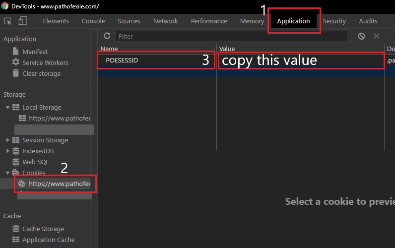

# PoE Prices
tool to retrive market value of an Item.

# Download
see [releases section](https://github.com/Bombshock/poe-prices/releases)

# Login

## Username
Visit [pathofexile.com](https://www.pathofexile.com/) and log in to your account.

## Session
Visit [pathofexile.com](https://www.pathofexile.com/) and log in to your account. Open the devtools (F12). Continue with the Browser section below according to which one you use.

### Chrome
Navigate to `Application > Cookies > pathofexile.com` and copy the `value` of `POESESSID`
